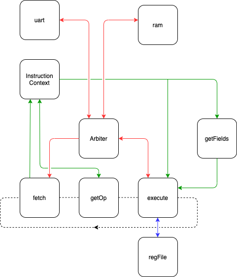

# nimulatorPPC

POWER9 emulator in Nim.

# Getting Started
## Dependencies
 - gcc-powerpc64le-linux-gnu
 - [nim](https://nim-lang.org/install.html)
 - (optional) [qemu](https://wiki.qemu.org/Documentation/Platforms/PowerPC)
```bash
apt-get update && apt-get install -y gcc-powerpc64le-linux-gnu make nim
```

## Running
Modify ``config.json`` with desired simulator configuration.

```bash
git clone https://github.com/BracketMaster/nimulatorPPC
cd nimulatorPPC
pushd resources/loopback
make
popd
nim c -r src/nimulatorPPC.nim
```

## Verifying with Qemu
The generated firmware should also work in Qemu

```
qemu-system-ppc64 -M powernv -cpu POWER9 -nographic -bios resources/loopback_asm/firmware.bin
```

# Design



The architecture of this simulator somewhat resembles the architecture
of a multicyle CPU. The simulator simulates a single stage at a time,
and continuously cycles through all stages.

# Status 

Not yet ready!!

Currently just advances the program counter and decodes instructions.

# TODO

 - [ ] populate .gitignore with all binaries to possibly be generated
 - [ ] build a binary that allows me to print registers
 - [x] get mvp loopback going in QEMU
 - [x] use QEMU + gdb to figure out what is wrong
 - [x] dockerfile
 - [x] read binaries
 - [x] pass path argument
 - [x] support bi-endian reads
 - [x] MnemonicEnum -> bitPat
 - [x] MnemonicEnum -> FormEnum
 - [x] start decoding
       - [x] use xor for pattern matching(should work?)
       - [x] test endianness with decode
 - [ ] FormEnum -> FieldSelect
 - [ ] Add sane debug and logging facilities
 - [x] support bi-endian writes
 - [x] convert from seq to arr
 - [x] replace bitslice with use non-mutating bitsliced
 - [x] determine whether or not binary fits in memory
 - [x] rework loadMemory to take a file
 - [x] reword loadMemory to have docs
 - [x] add docs to repository
 - [ ] support quad reads